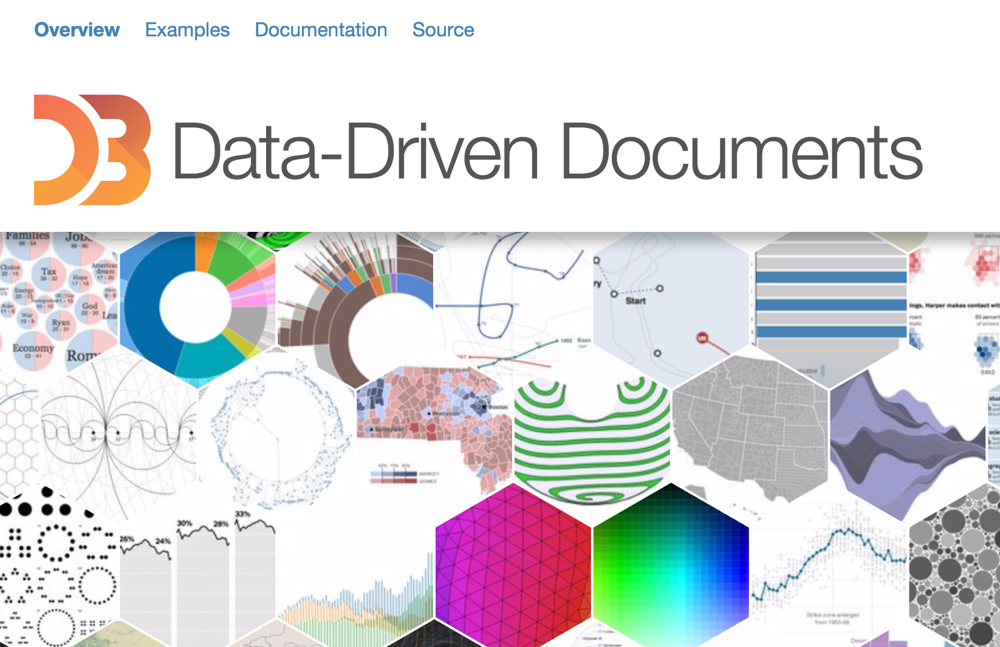
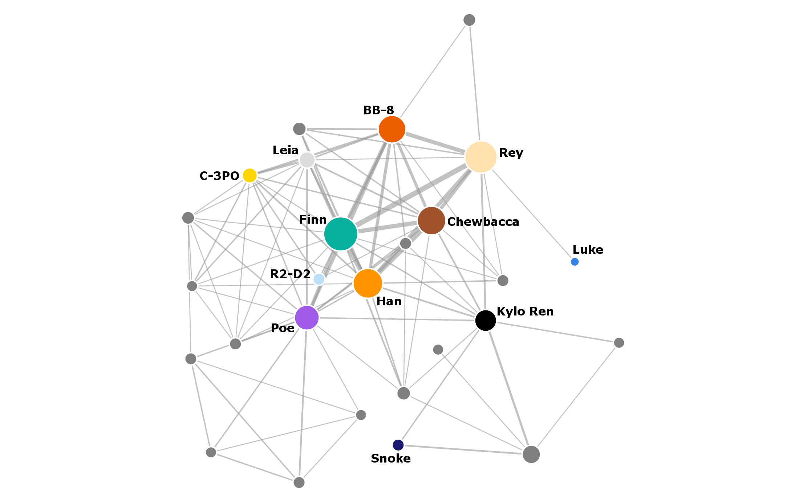

- title : The F#orce awakens
- description : Exploring the Star Wars social network with F#.
- author : Evelina Gabasova
- theme : white
- transition : none

******************************************************

- data-background : #000000

# Warning

Contains *some* spoilers for episodes I - VII  

--------

- data-background : images/StarWarsIntro-full-noloop.gif

' Main message: F# is good for data science
' - parsing script files
' - displaying the network with D3.js
' - interoperability with R
' - type providers - swapi
' - type providers for neo4j? Fill database with swapi, then perform queries
' - why even do this - fun interpretable data - find how methods perform & 
' compare -> then use them on more complex data (some cancer example)
' - other applications of the same methods
'    - type providers for data sources - show how to access data sources in other languages? python, R, scala?
'     - polyglot programming - combination with R
'    - network analysis - social network analysis on Twitter, biology, distribution networks

' Takeaway points:
' - F# is a good language for data science - allows good combination with other methodologies
' + real-world data science is messy
' + how to write a parser in a nice way
' + principles of network analysis

' The Galactic Republic is confused. Not only are the Star Wars scripts available just in poorly formatted HTML format, but there are also characters who are important in the films but they do not speak in the scripts at all! The Jedi Council has summoned a young Jedi knight Evelina to help the republic. The F#orce is strong with her but her task is not simple. She has to parse the scripts, extract the Star Wars social network and finally answer the most important question in the galaxy: Why were the prequels crap?

----------
- data-background : #000000

# 
 the star wars 

# 
 social network

' about me
' what I was trying to do
' example of several programming tasks & how to solve them

------

' This structure is highly formalised, names have to be in boldface and centered etc.

-----

-----

- data-background : #212d30

# Parsing scripts

    [lang=html]
    <b> INT. MOS EISLEY SPACEPORT - DOCKING BAY 94 </b>

    Chewbacca leads the group into a giant dirt pit that is 
    Docking Bay 94. Resting in the middle of the huge hole is a 
    large, round, beat-up, pieced-together hunk of junk that 
    could only loosely be called a starship.

    <b> LUKE </b>
    What a piece of junk.

    The tall figure of Han Solo comes down the boarding ramp.

-----
- data-background : #212d30

# Parsing scripts

    open FSharp.Data

    let url = "http://www.imsdb.com/scripts/Star-Wars-A-New-Hope.html"
    let episodeHtml = 
        HtmlDocument.Load(url).Descendants("pre") |> Seq.head

    let boldItems = 
        episodeHtml.Elements("b") 
        |> List.map (fun x -> x.InnerText().Trim())

-----
- data-background : #212d30

# Parsing scripts

-----
- data-background : #212d30

# Parsing scripts

    let rec parseScenes sceneAcc characterAcc (items: string list) =
       match items with
       | item::rest ->
           match item with
           | SceneTitle title -> 
                // add the finished scene to the scene accumulator
                let fullScene = List.rev characterAcc
                parseScenes (fullScene::sceneAcc) [] rest
           | Name name -> 
                // add character's name to the character accumulator
                parseScenes sceneAcc (name::characterAcc) rest
           | Word -> // do nothing
                parseScenes sceneAcc characterAcc rest
       | [] -> List.rev sceneAcc     

-----
- data-background : #212d30

# Parsing with active patterns

    let (|SceneTitle|Name|Word|) (text:string) =
        let scenePattern = "[ 0-9]*(INT.|EXT.)[ A-Z0-9]"
        let namePattern = "^[/A-Z0-9]+[-]*[/A-Z0-9 ]*[-]*[/A-Z0-9 ]+$"
        if Regex.Match(text, scenePattern).Success then
            SceneTitle text
        elif Regex.Match(text, namePattern).Success then
            Name text
        else Word

-----
- data-background : #212d30

# (| Active patterns |)

hide complexity behind readable code

-------

- data-background : images/trashcompactor-loop3.gif

-------

-------

- data-background : images/r2d2beeps-loop3.gif

--------

--------

--------

--------

--------

- data-background : images/darth-maul-loop3.gif

--------

- data-background : images/lonelyluke-loop3.gif

--------

--------

--------

# List of Star Wars characters

[swapi.co](https://swapi.co/)

----------

- data-background : #000000

----------

- data-background : #000000

----------

- data-background : images/darthvader-darkside-loop3.gif

----------

- data-background : images/darthvader-nope-loop3.gif

----------

- data-background : images/csharp-swapi.gif

----------

- data-background : #000000

# 
fsharp-swapi

[github.com/evelinag/fsharp-swapi](https://github.com/evelinag/fsharp-swapi)

[swapi.co](https://swapi.co/documentation)

----------

# 
visualization

----------

' Exporting and importing the network with Json?

----------

- data-background : images/networks/full_network-darth-vader.png

<a href="images/networks/interactions-merged.html" style="color: transparent;"> Big link to full network   Big link to full network  Big link to full network </a>

----------

# 
the phantom menace

----------

# 
a new hope

----------

# 
the force awakens

----------

# 
network analysis

Who is the most central character?

- Degree
- Betweenness

-----
# Degree

-----
# Degree

-----
# Degree

------
# Degree

 

$$$
\text{Degree}(v) = \text{Number of links }v \leftrightarrow v' \\
v \neq v'

-----
# Betweenness

-----
# Betweenness

-----
# Betweenness

-----
# Betweenness

-----
# Betweenness

-----
# Betweenness

 

$$$
S_v = \text{Number of shortest paths between $a$ and $b$ through $v$} \\
S = \text{Number of shortest paths between $a$ and $b$} \\ \\
\text{Betweenness}(v)_{ab} = \frac{S_v}{S}

-----
# Betweenness

 

$$$
S_v = \text{Number of shortest paths between $a$ and $b$ through $v$} \\
S = \text{Number of shortest paths between $a$ and $b$} \\ \\
\text{Betweenness}(v) = \sum_{ab} \frac{S_v}{S}

-----
- data-background : #212d30

# R

    [lang=R]
    library(igraph)

    centrality <- betweenness(network)

-----
- data-background : #212d30

# F#

    open RProvider.igraph

    let centrality = R.betweenness(network)

-----
- data-background : #212d30

# 
 Star Wars 

# 
 Degree and betweenness

-----

<table>
<tr>
  <td class="noborder">

## Original trilogy

| | Name | Degree |
|---|-----|-----|
| 1. | LUKE | 26 |
| 2. | C-3PO | 20 |
| 3. | LEIA | 19 |
| 4. | HAN | 16 |
| 5. | DARTH VADER | 16 |

</td>
  <td class="noborder">

## Prequels 

| | Name | Degree |
|---|-----|-----|
| 1. | ANAKIN | 40 |
| 2. | PADME | 34 |
| 3. | OBI-WAN | 32 |
| 4. | QUI-GON | 27 |
| 5. | JAR JAR | 24 |

  </td>
  </tr>
</table>

-----

<table>
<tr>
  <td class="noborder">

## Original trilogy

| | Name | Betweenness |
|---|-----|-----|
1. | LUKE | 108.6 |
2. | C-3PO | 68.5 |
3. | VADER | 56.2 |
4. | LEIA | 45.0 |
5. | HAN | 30.2 |

</td>
  <td class="noborder">

## Prequels 

| | Name | Betweenness |
|---|-----|-----|
1. | OBI-WAN | 210.4 |
2. | PADME | 209.4 |
3. | QUI-GON | 140.7 |
4. | EMPEROR | 103.2 |
5. | JAR JAR | 87.1 |

  </td>
  </tr>
</table>

-----

- data-background : images/jarjar-loop3.gif

------

# 
 the force awakens 

<table>
<tr>
  <td class="noborder">

| | Name | Degree |
|---|-----|-----|
| 1. | POE | 16 |
| 2. | FINN | 14 |
| 3. | HAN | 14 |
| 4. | CHEWBACCA | 12 |
| 5. | BB-8 | 12 |

</td>
  <td class="noborder">

| | Name | Betweenness |
|---|-----|-----|
1. | KYLO REN | 35.5 |
2. | POE | 20.3 |
3. | FINN | 14.0 |
4. | HAN | 14.0 |
5. | REY | 13.5 |

</td>
</tr>
</table>

-----

- data-background : images/rey-loop3.gif

------

- data-background : #000000

# 
 who is the most central? 

------

- data-background : images/obi-wan-loop3.gif

-----

- data-background : images/c3po-loop3.gif

-----
# Network structure

How do the the movies differ?

- Size
- Density
- Clustering coefficient

-----
# Size

-----
- data-background : images/senate.jpeg

-----
# Density

-----
# Density

-----
# Density

 

$$$
\begin{align}
\text{Density} &= \frac{\text{Existing connections}}{\text{Potential connections}} \\
& \\
&= \frac{\text{Existing connections}}{\frac{1}{2}N(N-1)}
\end{align}

-----
# 
 Density 

-----
# Clustering coefficient

-----
# Clustering coefficient

-----
# Clustering coefficient

-----
# Clustering coefficient

-----
# Clustering coefficient

-----
# Clustering coefficient

-----
# Clustering coefficient

 

$$$
K_v = \text{Number of neighbours of $v$} \\
E_v = \text{Number of links between neighbours of $v$} \\ \\
\text{Clustering}(v) = \frac{E_v}{\frac{1}{2} K_v (K_v - 1)}

-----
# Clustering coefficient

 

$$$
K_v = \text{Number of neighbours of $v$} \\
E_v = \text{Number of links between neighbours of $v$} \\ \\
\text{Clustering}(\text{network}) = \frac{1}{N} \sum_v \frac{E_v}{\frac{1}{2}  K_v (K_v - 1)}

-----

# 
 Clustering coefficient 

-----
- data-background : #212d30

# R

    [lang=R]
    library(igraph) 

    density <- graph_density(network)
    clusteringCoef <- transitivity(network, "undirected")

-----
- data-background : #212d30

# F#

    open RProvider.igraph

    let density = R.graph_density(network)
    let clusteringCoef = R.transitivity(network, "undirected")
        

' The point is that data science is very polyglot
' and there's no point in re-implementing algorithms
' over and over again. Just use your favourite language
' and call other languages from it!

----------
- data-background : #212d30

# Google Charts with XPlot

    open XPlot.GoogleCharts

    densities
    |> Array.mapi (fun i c -> "Episode " + string (i+1), c * 100.0 )
    |> Chart.Bar

----------

# Star Wars network in Neo4j

----------
# Network analysis in the real world

<table>
<tr>
  <td class="noborder">

</td>
<td class="noborder">

## Central accounts

1. @dsyme
2. @VisualFSharp
3. @migueldeicaza
4. @tomaspetricek
5. @c4fsharp 

November 2014

</td>
</tr>
</table>

-----
# Network analysis in the real world

Source: A. Barabasi - Network Science, 2016.

-----
# Network analysis in the real world

Social networks

Online chat communication

Email communication

Supply grids

Biological networks

...

' identify thought leaders, important hubs in the company
' Betweenness in biological pathways 
' Both cancer driver genes and tumour suppressor genes tend to have high betweenness in protein interaction networks 
' dependencies in code 
' code repositories - people who contribute to the same project

----------

- data-background : images/cell-betweenness.jpg

----------

- data-background : #550080

Parsing scripts in a functional way

Polyglot data science

Type providers

Network science

Having fun with interesting data

' Why does it make sense - playing with interesting data

----------

<table>
<tr>
<td class="noborder">

</td><td class="noborder">

# Learning more 

 - The F# Foundation [www.fsharp.org](http://www.fsharp.org)

 - FsLab package [www.fslab.org](http://www.fslab.org)

 - igraph package [igraph.org/r](http://igraph.org/r/)

</td>
</tr>
</table>

----------

# Star Wars resources

- [Internet Movie Script Database](http://www.imsdb.com/)

- [swapi : Star Wars API](https://swapi.co/)

- [The Star Wars social network](http://evelinag.com/blog/2015/12-15-star-wars-social-network/index.html)

- [Star Wars social networks: The Force Awakens](http://evelinag.com/blog/2016/01-25-social-network-force-awakens/index.html)

- [Star Wars Neo4j demo](http://portal.graphgist.org/graph_gists/855363c7-cdeb-4c8b-b4a5-b72c8f2388e3)

----------

# Thank you!

<table>
<tr>
  <td class="noborder"></td>
  <td style="vertical-align:middle" class="noborder"> [@evelgab](https://twitter.com/evelgab)</td>
</tr>
<tr>
  <td class="noborder"></td>
  <td class="noborder" style="vertical-align:middle" > [github.com/evelinag](https://github.com/evelinag)</td>
</tr>
<tr>
  <td class="noborder"></td>
  <td class="noborder" style="vertical-align:middle" > [evelinag.com](http://evelinag.com)</td>
</tr>
</table>

--------

- data-background : images/kyloapproves-loop3.gif