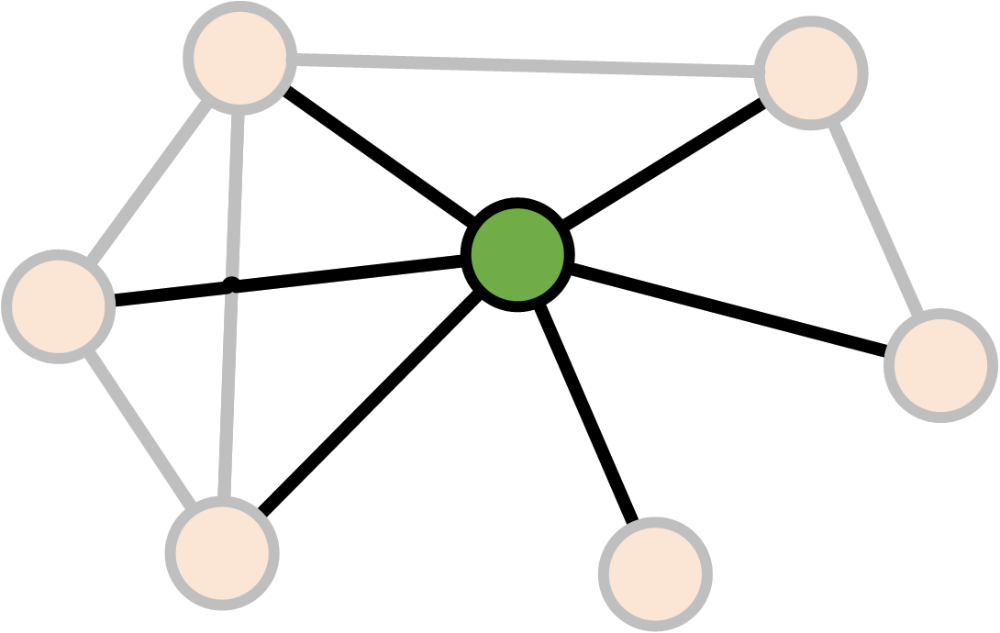
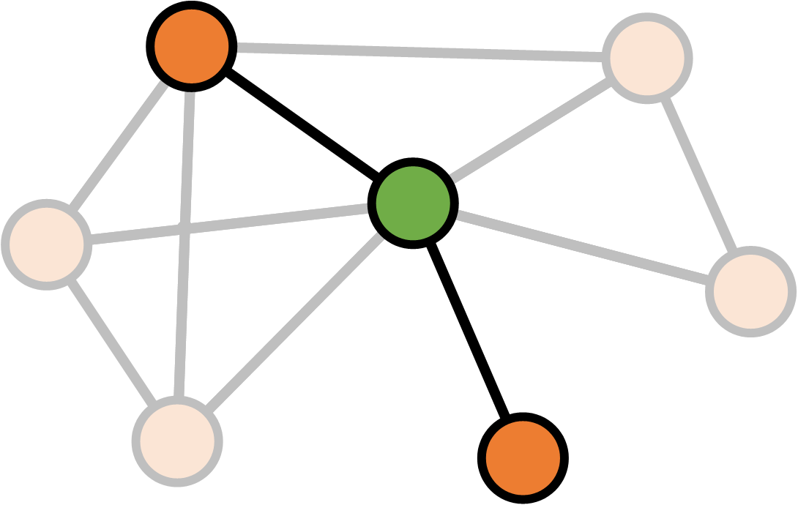
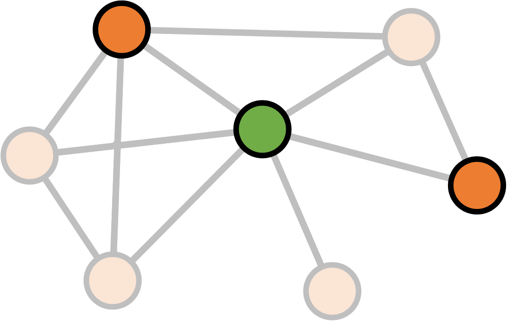

- title : The F#orce awakens
- description : Exploring the Star Wars social network with F#.
- author : Evelina Gabasova
- theme : white
- transition : none

******************************************************

- data-background : images/kylo.gif

<table>
<tr>
  <td class="noborder" style="width:50%;"></td>
   <td class="noborder" style="width:50%;">

## 
The F#orce Awakens

## 
Evelina Gabasova

@evelgab 
  

*Warning* 

Contains *some* spoilers

</td> 
</tr>
</table>

---

- data-background : images/tcga-dna.jpg

' During the day, I do bioinformatics and computational biology,
' researching mechanisms of early carcinogenesis at Cambridge
' University - I deal with DNA, genes, proteins etc...
' It's a very important work, we work on pancreatic cancer which 
' one of the least understood types of cancer. It's very hard to treat
' and mortality hasn't improved much over the last 10 years, so it's a big 
' and important challenge. We use quite a lot of methods, based on 
' statistics, machine learning and network analysis. 
' But biology is complex and sometimes it's a bit too much...

---

- data-background : images/pathways.png

' do you know the feeling? So because I love working with data, outside
' of work I like to play with other datasets, datasets that are
' probably less useful...

</section>
<section data-background-video="https://s3-eu-west-1.amazonaws.com/evelinag/intro.mp4" data-background-color="#000000">
</section>
<section data-background-transition="fade" data-background="images/SWLogo.png" data-background-color="#000000">

---

---

- data-background : #f2a063

' This structure is highly formalised, names have to be in boldface and centered etc.

-------

- data-background : white

-----

- data-background : #212d30

### Parsing scripts

    [lang=html]
    <pre>
    ...
        <b> INT. MOS EISLEY SPACEPORT - DOCKING BAY 94 </b>

    Chewbacca leads the group into a giant dirt pit that is 
    Docking Bay 94. Resting in the middle of the huge hole is a 
    large, round, beat-up, pieced-together hunk of junk that 
    could only loosely be called a starship.

        <b> LUKE </b>
    What a piece of junk.

    The tall figure of Han Solo comes down the boarding ramp.
    ...
    </pre>

' fsharp data has decent html parser which lets you select all 
' the elements in bold    

-----

- data-background : images/parsing-code-original2.png

  <h1 style="color: #ffffff">Parsing scripts</h3>

-----
- data-background : #212d30

### Parsing scripts

    let rec parseScenes sceneAcc characterAcc (items: string list) =
       match items with
       | item::rest ->
           match item with
           | SceneTitle title -> 
                // add the finished scene to the scene accumulator
                let fullScene = List.rev characterAcc
                parseScenes (fullScene::sceneAcc) [] rest
           | Name name -> 
                // add character's name to the character accumulator
                parseScenes sceneAcc (name::characterAcc) rest
           | Word -> // do nothing
                parseScenes sceneAcc characterAcc rest
       | [] -> List.rev sceneAcc     

-----
- data-background : #212d30

### Parsing with active patterns

    let (|SceneTitle|Name|Word|) (text:string) =
        let scenePattern = "[ 0-9]*(INT.|EXT.)[ A-Z0-9]"
        let namePattern = "^[/A-Z0-9]+[-]*[/A-Z0-9 ]*[-]*[/A-Z0-9 ]+$"
        if Regex.Match(text, scenePattern).Success then
            SceneTitle text
        elif Regex.Match(text, namePattern).Success then
            Name text
        else Word

-----
- data-background : #550080

# (| Active patterns |)

hide complexity behind readable code

-----

- data-background : images/itsatrap3.gif

--------

--------

--------

- data-background : images/tion-medon-photo.png

-------

- data-background : images/r2d2beeps-loop3.gif

--------

--------

--------

- data-background : #550080

## Number of *common* mentions

# ⬇

## Number of interactions

--------

--------

--------

- data-background : images/ewoks.gif

--------

- data-background : images/lonely-luke.gif

--------

- data-background : #000000

### Theorem: 

# There's an API for everything.

### Proof: 

### [swapi.co](https://swapi.co/)

----------

- data-background : #000000

----------

- data-background : #000000

----------

- data-background : images/darthvader-darkside-loop3.gif

----------

- data-background : images/csharp-swapi.gif

----------

- data-background : #000000

----------

- data-background : #000000

### 
fsharp-swapi

[github.com/evelinag/fsharp-swapi](https://github.com/evelinag/fsharp-swapi)

[swapi.co](https://swapi.co/documentation)

---

- data-background : #000000

### 
scenes

# + 
### 
characters

----------

---

---

---

- data-background : images/rey_bb8-loop2.gif

----------

# 
visualization

----------

' Exporting and importing the network with Json?
' Because F# works very well with JSON, maybe I can just use something that will read the JSON 

----------

----------

----------

----------

- data-background : images/networks/full_network-darth-vader.png

<a href="images/networks/interactions-merged.html" style="color: transparent;"> Big link to full network   Big link to full network  Big link to full network </a>

----------

### 
the phantom menace

----------

### 
a new hope

----------

### 
the force awakens

-----

# Network structure

How do the the movies differ?

-----

### 
 Size 

-----

### Density

-----
### Density

-----
### Density

 

$$$
\begin{align}
\text{Density} &= \frac{\text{Existing connections}}{\text{Potential connections}} \\
& \\
&= \frac{\text{Existing connections}}{\frac{1}{2}N(N-1)}
\end{align}

-----

### 
 Density 

-----
### Clustering coefficient

-----
### Clustering coefficient

-----
### Clustering coefficient

-----
### Clustering coefficient

-----
### Clustering coefficient

-----
### Clustering coefficient

-----
### Clustering coefficient

 

$$$
K_v = \text{Number of neighbours of $v$} \\
E_v = \text{Number of links between neighbours of $v$} \\ \\
\text{Clustering}(v) = \frac{E_v}{\frac{1}{2} K_v (K_v - 1)}

-----
### Clustering coefficient

 

$$$
K_v = \text{Number of neighbours of $v$} \\
E_v = \text{Number of links between neighbours of $v$} \\ \\
\text{Clustering}(\text{network}) = \frac{1}{N} \sum_v \frac{E_v}{\frac{1}{2}  K_v (K_v - 1)}

--------

### 
 Clustering Coefficient 

' How many of your friends in the network are also friends with each other
' What it means in terms of the story

-----
### Degree

-----
### Degree

-----
### Degree

------
### Degree

 

$$$
\text{Degree}(v) = \text{Number of links }v \leftrightarrow v' \\
v \neq v'

-----
### Betweenness

-----
### Betweenness

-----
### Betweenness

-----
### Betweenness

-----
### Betweenness

-----
### Betweenness

 

$$$
S_v = \text{Number of shortest paths between $a$ and $b$ through $v$} \\
S = \text{Number of shortest paths between $a$ and $b$} \\ \\
\text{Betweenness}(v)_{ab} = \frac{S_v}{S}

-----
### Betweenness

 

$$$
S_v = \text{Number of shortest paths between $a$ and $b$ through $v$} \\
S = \text{Number of shortest paths between $a$ and $b$} \\ \\
\text{Betweenness}(v) = \sum_{ab} \frac{S_v}{S}

-----
- data-background : #212d30

# R

    [lang=R]
    library(igraph)

    b <- betweenness(network)

-----
- data-background : #212d30

# F#

    open RProvider.igraph

    let b = R.betweenness(network)

---

### 
 Centrality 

<small>
<table>
<tr>
  <td class="noborder" style="padding-right: 100px">

| | Name | Degree |
|---|-----|-----|
| 1. | POE | 16 |
| 2. | FINN | 14 |
| 3. | HAN | 14 |
| 4. | CHEWBACCA | 12 |
| 5. | BB-8 | 12 |

</td>
  <td class="noborder">
  

| | Name | Betweenness |
|---|-----|-----|
1. | POE | 97.2 |
2. | KYLO REN | 71.9 |
3. | REY | 38.7 |
4. | BB-8 | 29.1 |
5. | FINN | 26.8 |

</td>
</tr>
</table>
</small>

---

- data-background : images/poe_dancing0.gif

---

- data-background : images/obi-wan-noloop.gif

---

- data-background : images/darthvader-wins-loop2.gif

----------

### Star Wars network in Neo4j

----------

### Network analysis in the real world

<table>
<tr>
<td class="noborder">

</td><td class="noborder" style="vertical-align: top">

<h2 style="color: #e67e00">@fsharporg</h2>

1. @dsyme
2. @VisualFSharp
3. @migueldeicaza
4. @tomaspetricek
5. @c4fsharp 

November 2014
</td>
</tr>
</table>

-----
### Network analysis in the real world

Source: A. Barabasi - Network Science, 2016.

-----
## Network analysis in the real world

Social networks

Online chat communication

Email communication

Supply grids

Biological networks

...

' identify thought leaders, important hubs in the company
' Betweenness in biological pathways 
' Both cancer driver genes and tumour suppressor genes tend to have high betweenness in protein interaction networks 
' dependencies in code 
' code repositories - people who contribute to the same project

----------

- data-background : images/cell-betweenness.jpg

----------

- data-background : #550080

Parsing scripts in a functional way

Polyglot data science

Type providers

Network science

Having fun with interesting data

' Why does it make sense - playing with interesting data

----------

<table>
<tr>
<td class="noborder">

</td><td class="noborder">

### Learning more 

 - The F# Foundation [www.fsharp.org](http://www.fsharp.org)

 - FsLab package [www.fslab.org](http://www.fslab.org)

 - igraph package [igraph.org/r](http://igraph.org/r/)

</td>
</tr>
</table>

----------

### Star Wars resources

- [Internet Movie Script Database](http://www.imsdb.com/)

- [swapi : Star Wars API](https://swapi.co/)

- [The Star Wars social network](http://evelinag.com/blog/2015/12-15-star-wars-social-network/index.html)

- [Star Wars social networks: The Force Awakens](http://evelinag.com/blog/2016/01-25-social-network-force-awakens/index.html)

- [Star Wars Neo4j demo](http://portal.graphgist.org/graph_gists/855363c7-cdeb-4c8b-b4a5-b72c8f2388e3)

----------

- data-background : images/kyloapproves-loop3.gif

-----

- data-background : images/kylo.gif

<table>
<tr>
  <td class="noborder" style="width:40%;"></td>
   <td class="noborder" style="width:60%;">

## 
Evelina Gabasova

@evelgab 
 

evelinag.com/star-wars-talk
 

github.com/evelinag

</td> 
</tr>
</table>
